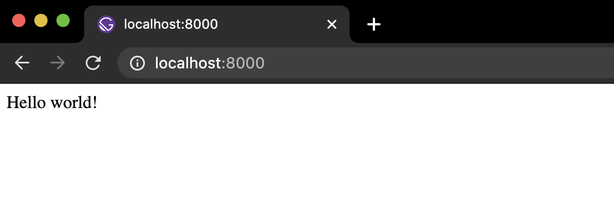
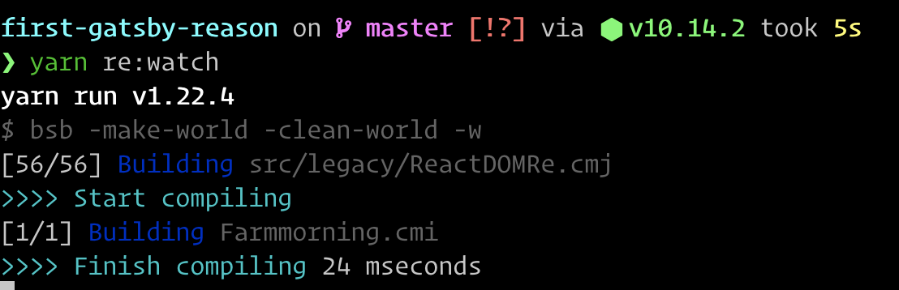
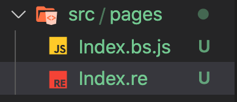
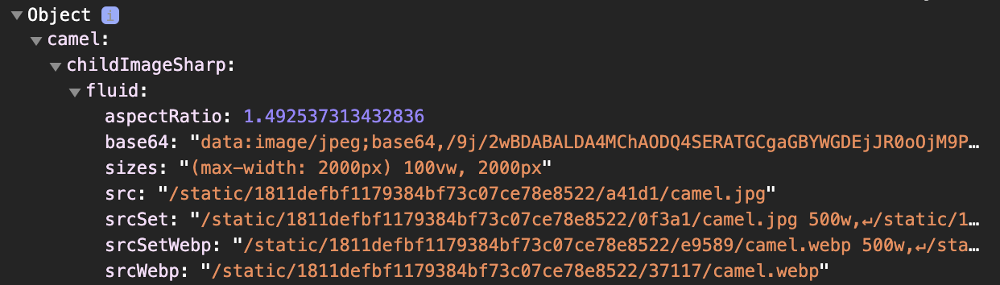
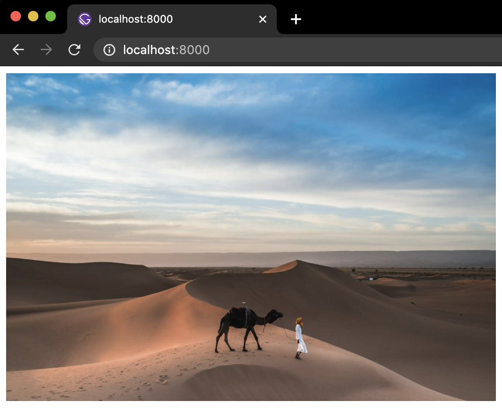

# Gatsby에 ReasonML 끼얹기
## 들어가며
저는 그린랩스 웹개발팀의 프론트엔드 개발자 문운기라고 합니다. 다른 포스트에서 이미 다룬 바와 같이, 저희 그린랩스 웹개발팀은 ReasonML을 도입하여 개발을 하고 있습니다. 아마도 다른 포스트에서 왜 저희 팀이 ReasonML을 도입하였는지에 대한 설명이 있었을 것이라 생각하여, 그에 대한 내용은 이 포스트에서 다루진 않겠습니다.

이번 포스트에서는 저희 팀에서 사용하고 있는 웹프레임워크인 Gatsby(팀내에서는 `갓`츠비라고 부르고 있습니다. 존엄!)를 ReasonML로 개발하는 과정 및 그 과정에서 얻은 경험을 공유하려고 합니다.

다룰 내용은 아래와 같습니다.
1. ReasonML로 Gatsby로 웹페이지 만들기
2. Gatsby 플러그인을 이용하여 Gatsby GraphQL Query를 이용하여 image 불러오기

## Prerequisites
* ReasonML의 문법
* ReasonReact에 대한 약간의 지식
* Gatsby에 대한 기본 지식

> sample code: https://github.com/mattdamon108/first-gatsby-reasonml
  
## Gatsby에 ReasonML 끼얹기
Godtsby, 아니 Gatsby를 처음 initialize하는 과정은 자세히 다루진 않겠습니다. 이미 Gatsby 공식 문서의 [Quick Start](https://www.gatsbyjs.com/docs/quick-start/)에도 아주 잘 설명되어있습니다.

짜잔~!

Hello world!까지는 문제 없이 보셨죠? 이제 본격적으로 ReasonML을 조금씩 끼얹어보겠습니다.

우선, ReasonML은 OCaml의 syntax sugar로서 OCaml 컴파일러가 아닌 [BuckleScript](https://rescript-lang.org/)의 컴파일러를 이용해서 Javascript 코드를 트랜스컴파일 합니다. (왜 BuckleScript라고 하구선 링크는 ReScript라는 곳으로 연결될까?라고 하시는 분들께는 별도의 포스트로 OCaml/ReasonML/BuckleScript/ReScript의 어두운 과거를 되짚는 포스트에서 자세히 설명드리도록 하겠습니다. 우선 넘어가자구요 🤔)
### BuckleScript를 추가하기
BuckleScript라는 컴파일러를 프로젝트에 추가하는 것은 매우 간단합니다.

```shell
$ yarn add --dev bs-platform
or
$ npm install --save-dev bs-platform
```
> https://reasonml.github.io/docs/en/installation#existing-project

현재 최신 버젼은 @8.2.0이군요. 잘 설치가 되었다면, `bsconfig.json` 파일을 프로젝트 root 경로에 생성해줍니다.

```json
{
  "name": "farmmorning",
  "reason": {
    "react-jsx": 3
  },
  "bsc-flags": ["-bs-super-errors"],
  "sources": [
    {
      "dir": "src",
      "subdirs": true
    }
  ],
  "package-specs": [
    {
      "module": "es6",
      "in-source": true
    }
  ],
  "suffix": ".bs.js",
  "namespace": true,
  "bs-dependencies": ["reason-react"],
  "ppx-flags": [],
  "refmt": 3
}
```
>https://reasonml.github.io/reason-react/docs/en/installation#adding-reason-to-an-existing-reactjs-project-create-react-app-nextjs-etc

그리고 `reason-react` 모듈을 설치해줍니다.

```shell
$ yarn add reason-react
```

이후 편하게 사용할 수 있게 몇 가지 스크립트를 package.json에 추가해줍니다.
```json
"scripts": {
    ...
    "re:build": "bsb -make-world -clean-world",
    "re:watch": "bsb -make-world -clean-world -w"
  },
```
이제 앞으로는 watch mode와 build는 위의 스크립트를 이용해서 실행합니다. 각각에 대해 간단히 설명하면, watch mode는 개발 중에 새로운 내용을 저장하면 *.re 파일을 *.bs.js 파일로 트랜스파일 해줍니다. 반면, build 스크립트는 production 배포를 위한 최적화한 build 명령어 입니다. 그럼 watch mode를 실행해볼까요?


따라라~🐫

앞으로 개발 중에는 watch 모드로 BuckleScript를 하나 돌려놓고, gatsby develop도 동시에 돌려놓습니다. 음.. 그런데 뭐 변한게 하나도 없어 보이네요. 그러면 본격적으로 ReasonML을 이용해서 index.js 파일을 *.re로 바꿔볼까요?

### 첫 ReasonML로 페이지 만들기 - Index.re
과감하게 index.js 파일을 지워버리고 Index.re 파일을 같은 위치에 만들어 봅니다.

```reason
// Index.re
[@react.component]
let make = () => {
  <div> {j|Hello world!|j}->React.string </div>
}
```

Watch 모드인 bsb가 새로 트랜스파일이 되면서 Index.bs.js 파일이 같은 위치에 생성된 것이 보일 겁니다.



그런데, Gatsby는 에러를 뿜습니다.

```
Error: EnsureResources was not able to find resources for path: "/"
This typically means that an issue occurred building components for that path.
Run `gatsby clean` to remove any cached elements.
```

에러가 발생하면, 고통스럽지만 에러 메세지를 뜯어보는 습관을 들이는 것이 좋다는 생각을 버릇처럼 해봅니다. 뜯어보면, "/" 경로의 resource를 찾을 수 없다는 내용 같군요.

원인은, Gatsby는 index.js를 default로 찾는데, 우리는 Index.bs.js밖에 없으니 루트 경로 페이지를 표시할 수가 없겠죠.

우리의 갓츠비는 이런 류의 Customizing 또한 예상하고 있었습니다.

프로젝트 루트 경로에 `gatsby-node.js`라는 파일을 만들어 줍니다.

```js
exports.createPages = async ({ graphql, actions }) => {
  const { createPage } = actions
  createPage({
    path: "/",
    component: require.resolve("./src/pages/Index.bs"),
    context: {},
  })
}
```

이 js 파일에 path 별로 어떤 js 파일을 찾아야할 지 설정해주는 거죠. 그런데...

```
Error: Element type is invalid: expected a string (for built-in components) or a class/function (for composite components) but got: object.

Check the render method of `HotExportedComponent`.
```

또 다시 고통스럽게 하나하나 읽어봅니다. 음..React에 경험이 있으신 분들의 경우 익숙한 내용일 겁니다. React 컴포넌트를 export를 제대로 하지 못했을 경우 종종 보던 메세지와 비슷하죠?

ReasonReact는 ReasonML의 convention을 따라 `make`라는 함수를 선언하여 React의 함수<strike>형</strike> 컴포넌트를 선언하는데, 이 make 함수가 default로 export되지 못한 것이죠. 트랜스파일된 Index.bs.js 파일을 열어보면 원인을 더욱 분명히 알 수 있습니다.

```js
// Generated by BUCKLESCRIPT, PLEASE EDIT WITH CARE

import * as React from "react";

function Index(Props) {
  return React.createElement("div", undefined, "Hello world!");
}

var make = Index;

export {
  make , // { make }로 export ㅠㅠ
  
}
/* react Not a pure module */
```

Minor한 언어를 하겠다고 마음 먹는다는 것은, 시련이 닥칠수록 웃을 수 있어야 한다는 것을 때론 의미합니다. Index.re의 내용을 이렇게 바꿔봅니다.

```reason
[@react.component]
let make = () => {
  <div> {j|Hello world!|j}->React.string </div>
}

let default = make;
```
...transpiled to
```js
// Generated by BUCKLESCRIPT, PLEASE EDIT WITH CARE

import * as React from "react";

function Index(Props) {
  return React.createElement("div", undefined, "Hello world!");
}

var make = Index;

var $$default = Index;

export {
  make ,
  $$default ,
  $$default as default,
  
}
/* react Not a pure module */
```

오늘도 한 고비를 넘겼다고 스스로를 격려해줍시다. 당신은 Gatsby에 ReasonML로 첫 페이지를 구현한 것 입니다 👏

### `gatsby-image` 플러그인으로 Image 불러오기

Minor한 언어를 하기로 마음 먹는다는 것은, 또한 작은 성취에 만족하지 않는다는 것을 의미하기도 합니다. 여느 때라면 이 정도 쯤에서 탕수육 한 점을 `찍먹`한 것처럼 해봤다는 데 의미를 둘 수 있을지도 모릅니다. 하지만 이 기세를 몰아서 이미지 파일을 하나 불러보겠습니다.

갓츠비에는 아주 유명한 image 관련 plugin이 있습니다. 아마 Gatsby로 프로젝트를 진행하시는 분들이라면 아마 대부분 사용하실텐데요.

```shell
$ yarn add gatsby-source-filesystem gatsby-image gatsby-transformer-sharp gatsby-plugin-sharp
```

그리고 `gatsby-config.js` 파일에 설치한 plugin을 설정해줍니다.

```js
// gatsby-config.js
const path = require("path")

module.exports = {
  plugins: [
    {
      resolve: "gatsby-source-filesystem",
      options: {
        name: "images",
        path: path.join(__dirname, "src", "images"),
      },
    },
    "gatsby-plugin-sharp",
    "gatsby-transformer-sharp",
  ],
}
```

Gatsby에서 이 플러그인을 사용해보셨던 분들은 아마 이 plugin 문서의 [how-to-use](https://www.gatsbyjs.com/plugins/gatsby-image/?=gatsby-image#how-to-use)와 같이 사용해보셨을 겁니다. 바로 그렇습니다. Gatsby를 갓츠비로 만들어주는 GraphQL 입니다. 이걸 ReasonML로 구현해보겠습니다.

우린 ReasonML의 JS Interop을 하려는 것 입니다. 다른 언어에서 FFI(Foreign Function Interop)라고도 하는 바로 그것이죠. ReasonML/ReScript가 내세우는 Killer feature 중 하나이기도 합니다.

`src/bindings/`라는 위치에 `Gatsby.re`라는 파일을 만듭니다. ReasonML에서 모든 *.re 파일은 `module`입니다. 즉 Gatsby라는 모듈이 생긴거죠. 이 모듈 안에 gatsby-image js 모듈을 binding 해보겠습니다.

```reason
[@bs.module "gatsby"]
external useStaticQuery: 'queryData => 'queryData = "useStaticQuery";

module Img = {
  type fixedObject = {
    width: int,
    height: int,
    src: string,
    srcSet: string,
    base64: Js.undefined(string),
    tracedSVG: Js.undefined(string),
    srcWebp: Js.undefined(string),
    srcSetWebp: Js.undefined(string),
    media: Js.undefined(string),
  };

  type fluidObject = {
    aspectRatio: float,
    src: string,
    srcSet: string,
    sizes: string,
    base64: Js.undefined(string),
    tracedSVG: Js.undefined(string),
    srcWebp: Js.undefined(string),
    srcSetWebp: Js.undefined(string),
    media: Js.undefined(string),
  };

  [@bs.module "gatsby-image"] [@react.component]
  external make:
    (
      ~key: string=?,
      ~fixed: fixedObject=?,
      ~fluid: fluidObject=?,
      ~alt: string=?,
      ~className: string=?
    ) =>
    React.element =
    "default";
};
```

> Binding도 다루기엔 상당히 많은 분량이어서, 다른 포스트에서 따로 자세히 다룰 기회가 있을 것 같습니다. 이번 포스트에서는 자세히 다루지 않고 넘어가겠습니다.

Binding한 useStaticQuery와 Gatsby.Img 모듈을 이용해서 optimized fluid image를 불러보겠습니다.

```reason
// Index.re

let usePageData = () => {
  Gatsby.useStaticQuery(
    [%bs.raw
      {|graphql`query {
        camel: file(relativePath: {eq: "camel.jpg"}) {
          childImageSharp {
            fluid(maxWidth:2000) {
              ...GatsbyImageSharpFluid_withWebp
            }
          }
        }
    }`|}
    ],
  );
};

[@react.component]
let make = () => {
  let data = usePageData();
  Js.log(data);

  <div> <Gatsby.Img fluid=data##camel##childImageSharp##fluid /> </div>;
};

let default = make;
```

몇가지 살펴봐야할 부분들을 정리해보면 이렇습니다.

1. `%bs.raw`를 사용해서 GraphQL query를 위한 JS 코드를 날 것 그대로 사용하였습니다.
   
2. `Js.log`를 이용해서 console.log 해보면, 이렇게 query된 데이터가 들어온 것을 확인할 수 있습니다.



3. 마지막으로 중요한 내용이 있는데요. `useStaticQuery`는 query 대상에 따라 type이 특정되는데, 타입을 인자로 받아, 그 인자에 해당하는 모든 결과 data의 type을 정해야합니다. 만약 여러분의 어플리케이션에서 해당 data가 type system을 이용해서 runtime의 에러를 compile time에서 제거해야할 필요가 있고 그만큼의 리소스를 투입해도 ROI가 나온다면 그렇게 해야할 것 입니다만, 저희는 페이지에 불러올 이미지는 개발 과정의 runtime에서 충분히 잡아낼 수 있고, 만약 production 배포 후의 문제라면 그건 type system으로도 막을 수 없는 기타의 문제(네트워크 에러, 등.)가 대부분일 것이라 판단하여, `##` escape hatch를 사용하였습니다. `##`를 사용하는 건 type system의 보호를 받을 수가 없습니다.



짜잔~! 👍

빠르게 image를 불러오는 것까지 Gatsby에 ReasonML을 끼얹어보았습니다. 이 포스트를 읽으셨다는 것은 한국어를 모국어로 하면서 ReasonML을 어느 정도 다뤄봤으며, 그 여정을 계속하고 계신 분이라고 생각되는데요. 그 여정이 저 사진의 낙타가 서있는 사막처럼 아무도 없는 듯 하고, 목이 타는 갈증에 괴롭더라도 그 여정의 끝에는 멋진 오아시스가 있을 것입니다. 응원합니다.